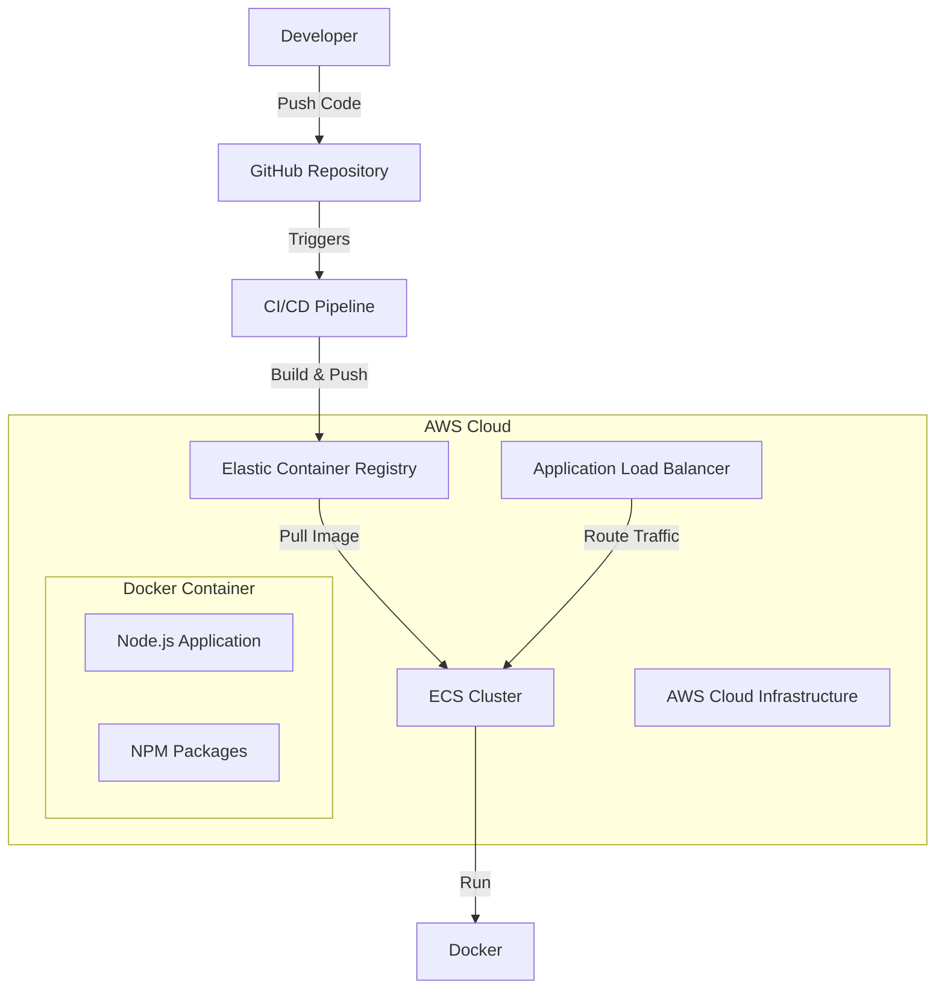

# Node.js Project Scaffold for AWS Infrastructure

This repository serves as a starting point for developing Node.js applications deployed on AWS infrastructure using Docker containers. It provides a standardized project structure and configurations to quickly spin up new Node.js microservices.

## Architecture Overview



## Key Features

- Dockerfile and container configurations optimized for Node.js
- AWS Infrastructure as Code templates (CloudFormation/CDK)
- CI/CD pipeline configuration
- Environment management
- Docker compose for local development
- Logging and monitoring setup
- Security best practices

## Getting Started

1. Clone this repository
2. Update configuration files with your project details
3. Configure AWS credentials and permissions
4. Build and run containers locally using docker-compose
5. Deploy to AWS using provided CI/CD pipeline

## Pre-requisites

- AWS Account
- Docker installed locally
- Node.js development environment
- AWS CLI configured

This scaffold accelerates the development process by providing a production-ready infrastructure setup while following cloud-native best practices.

## Database Configuration

### Neon Postgres Serverless Setup

1. Sign up for a Neon account at [neon.tech](https://neon.tech)
2. Create a new project and get your connection credentials
3. Add the following environment variables to your configuration:

```env
NEON_DB_HOST=your-project.neon.tech
NEON_DB_USER=your-username
NEON_DB_PASS=your-password
NEON_DB_NAME=your-database
```

4. Install the Postgres client:

```bash
npm install pg
```

5. Use the following code to connect:

```javascript
const { Pool } = require("pg");

const pool = new Pool({
  host: process.env.NEON_DB_HOST,
  user: process.env.NEON_DB_USER,
  password: process.env.NEON_DB_PASS,
  database: process.env.NEON_DB_NAME,
  ssl: true,
  max: 20,
  idleTimeoutMillis: 30000,
  connectionTimeoutMillis: 2000,
});
```

The serverless Postgres instance will automatically scale based on demand. No manual capacity planning is required.

Key Features:

- Auto-scaling compute and storage
- Built-in SSL encryption
- Branching capability for development environments
- Web console for database management
- Connection pooling for optimal performance
- Pay-per-use pricing model

## Support Development

If you find this scaffold helpful, you can support development by sending MATIC tokens to:

0x497586992F3F6af4719dFBcf5203d3A415DD8d3B

Your contributions help maintain and enhance this open source project. Thank you for your support!
